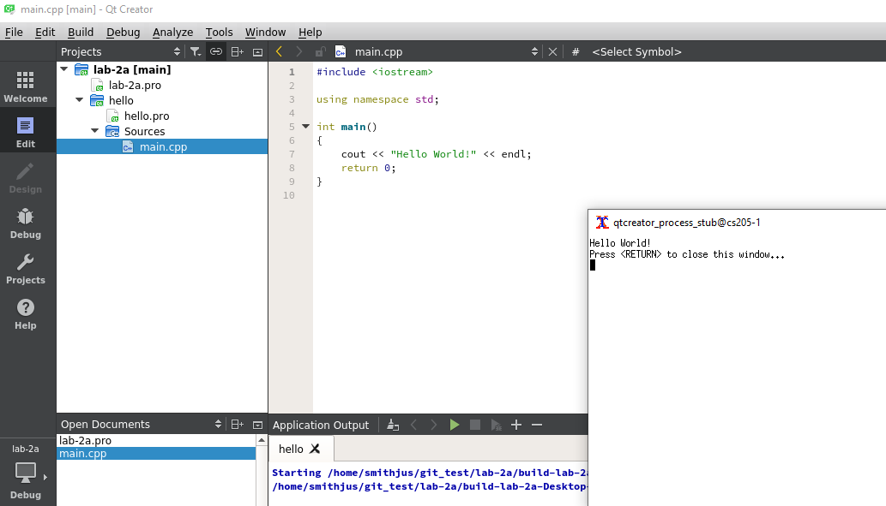

# Lab 2a—First project and subprojects

## Lab goals
1. Configuring Git and Qt Creator to work with each other, and creating the first project in the process.
2. Understanding Qt Creator subprojects to create a more structured work environment.

--------------------------------

## 1. X11 Forwarding—Launching GUI applications on the server

As mentioned in Lab 1, you will have the option to conduct your software development on your local machine or on the CS Department servers. To use the server, we will need to be able to run GUI applications remotely. In Lab 1, we ran terminal commands on the server via ssh. To enable GUI applications, we just need to specify one additional flag, the -X or -Y flag, when we ssh to the lab server.

For the rest of the course, when you connect to the lab server, be sure to specify the -X or -Y flag (depending on your local system). This will create a session with X11 forwarding enabled.

```
$ ssh -Y smithjus@139.147.9.XXX
```

Depending on your machines configuration, X11 connections can sometimes be unreliable with QT. If you run into issues, see your lab instructor for instructions to install QT Creator on your local machine.

### Testing X11 Connection
Once you have connected to your account with the -X or -Y flag launch a graphical application, such as:

```$ xclock```
or
```$ qtcreator```

You should see a clock (or the QT creator IDE) appear. (If you don't see anything immediatly, allow a minute or so for the command to be processed.) You can skip the next "Trobleshooting" section if the QT Creator GUI is visible.

### Troubleshooting X11 Connections

If you are on Mac, follow [these instructions](https://content.byui.edu/file/cddfb9c0-a825-4cfe-9858-28d5b4c218fe/1/Course/Setup-XQuartz.html) to install [xQuartz](https://www.xquartz.org) to enable X11 forwarding. 

Once you have downloaded and installed xQuartz, you will need to log out and log back in to your machine.

From the terminal, open Xquartz

```
$ open -a Xquartz
```

Now open up the preferences from the top menu and go to the last tab ‘security’. There we need to make sure the “allow connections from network clients” is checked “on”.

Now, from your Xquartz terminal, run:

```
$ ssh -Y smithjus@139.147.9.XXX
```

If you are still unable to connect, try manually opening an XQuartz terminal and ssh'ing from there (instead of from terminal).


## 2. Configure QT Creator and Git
In general, your workflow will be to (1) create a folder for each lab you are working on; (2) clone the repository for that lab into that folder; (3) then create a QT project in that folder. The subsequent steps will walk you through how to do that for the first time.

```
$ cd ~          # Make sure you are in your home directory
$ cd labs       # Keep all your labs in a dir called labs to keep things tidy :)
                # You may need to create this dir if you haven't already
```

Now clone the starter code from GitHub

```
$ git clone git@github.com:CS-205-S21/lab-2a.git  # Paste the clone string from GitHub here. Mine is here for reference, your string will be different...
```

Let's check to see that everything was cloned
```
$ ls
lab-2a
$ cd lab-2a
$ls -a     # The -a flag says show "all" files, including hidden files that start with '.'
.  ..  .git  .gitignore  README.md
```

Notice, that I have configured this repository to include a ```.gitignore``` file. This is an important file that helps you collaborate much more smoothly by telling git which files shouldn't be tracked. You can read more about .gitignore [here](https://docs.github.com/en/github/using-git/ignoring-files).

## 3. QT Creator
Once you have cloned your team's GitHub repo, we'll open QT Creator to create a new QT project


```
$ pwd
/home/smithjus/labs/lab-2a/
$ qtcreator
```

  - Tell qtcreator to use the correct terminal
    - Tools > Options > Environment (on the left) > System > Under "Terminal:" Select "/usr/bin/xterm -e"


  - Click "New Project" or select "File > New File or Project"
  - Select "Other Project > Subdirs Project > Choose"
  - In this window, **carefully** add the name of the directory where your repository is and the name of the repository you are using. In the example, Name is lab-2a, which is what you called it during the clone process, your name may differ slightly. Also, the field "Create in" is the directory where you put the repo.


  - This Kits bit is fiddly! The default kit is called Desktop. Just ask if you get stuck! By default "Desktop" should be selectected and you can just press "Next"
  - You will note that Qt Creator is Git-aware, just click "Done and Add Subproject ".
  - In this next window, pick "Non-QT Project" and "Plain C++ Project"


  - In this window, add the namoe of the subproject. For now we will use the name _hello_. 
    - Type _hello_ in the "Name:" field
    - Leave the "Create in:"  field as is "/home/username/labs/lab-2a/lab-2a"
  - Continue through the Build System screen with the default "qmake" selected
  - Continue through the Kits screen with the default Desktop selected
  - Again, nothing to do on the Summary screen. QTCreator is notifying you about all the files being created. 
  - In the end you will have the following. Click the "Run"
  
  


--------------


- With Terminal, change directory into your repository and add any new files, perform a commit, and push the changes so your lab partner has access to everything.

```
smithjus@cs205-1:~/git_test/lab-2a/lab-2a$ git status
On branch main
Your branch is up to date with 'origin/main'.

Changes to be committed:
  (use "git reset HEAD <file>..." to unstage)

        new file:   hello/hello.pro
        new file:   hello/main.cpp
        new file:   lab-2a.pro
smithjus@cs205-1:~/git_test/lab-2a/lab-2a$ git add -A # add all the files to the git repo
smithjus@cs205-1:~/git_test/lab-2a/lab-2a$ git commit -m "Created lab-2a qt project and hello sub project"
smithjus@cs205-1:~/git_test/lab-2a/lab-2a$ git push
```

## 4. Testing with your lab partner
- Once the checkout is successful, if you can compile and run the "hello" project, you are done!
- Try making changes in coordination with your lab partner to practice resolving merge conflicts

## 5. Notes
- You can experiment with the Git commands provided in the Tools menu, but you still need to work with the command line as you go along.

- For the remainder of the project, you do not need to perform any branching — just focus on normal commits and pushes and pulls. The next part of the lab will just require you and your partner to work on separate classes.

